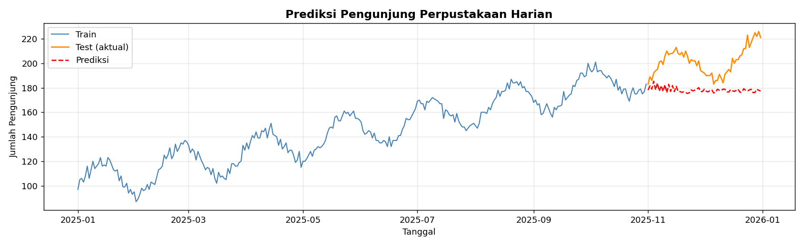
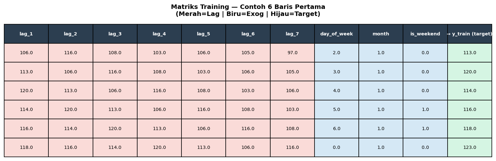
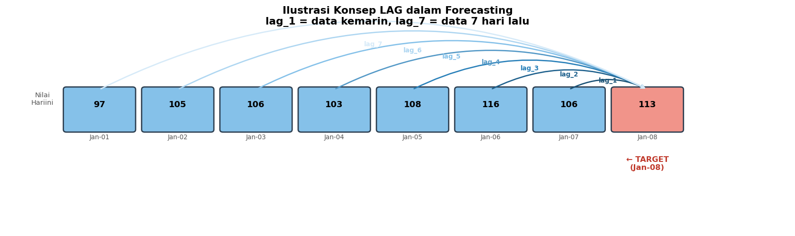
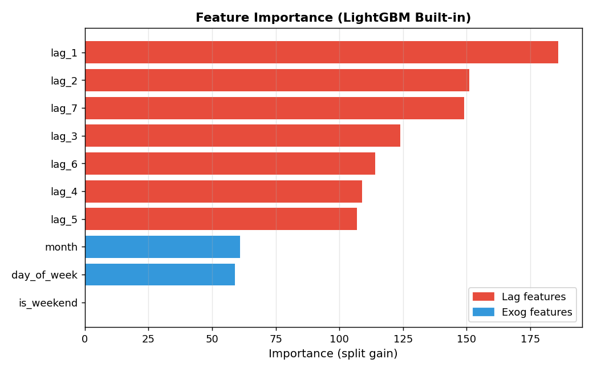
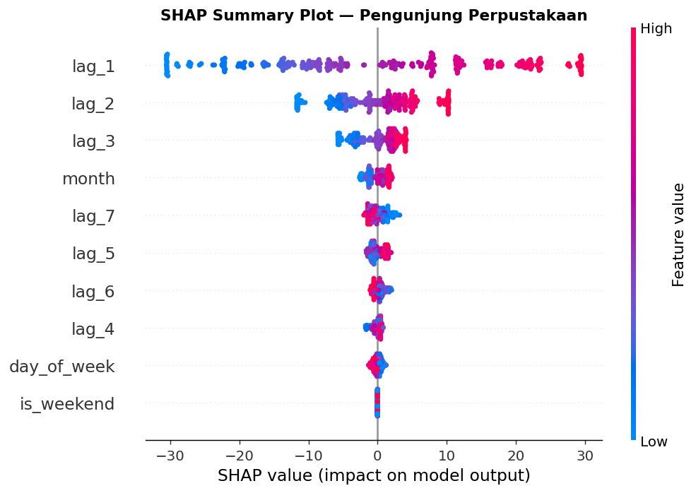
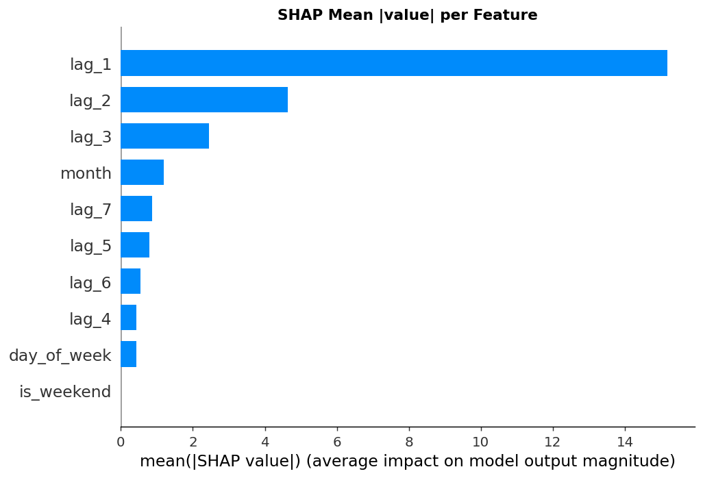
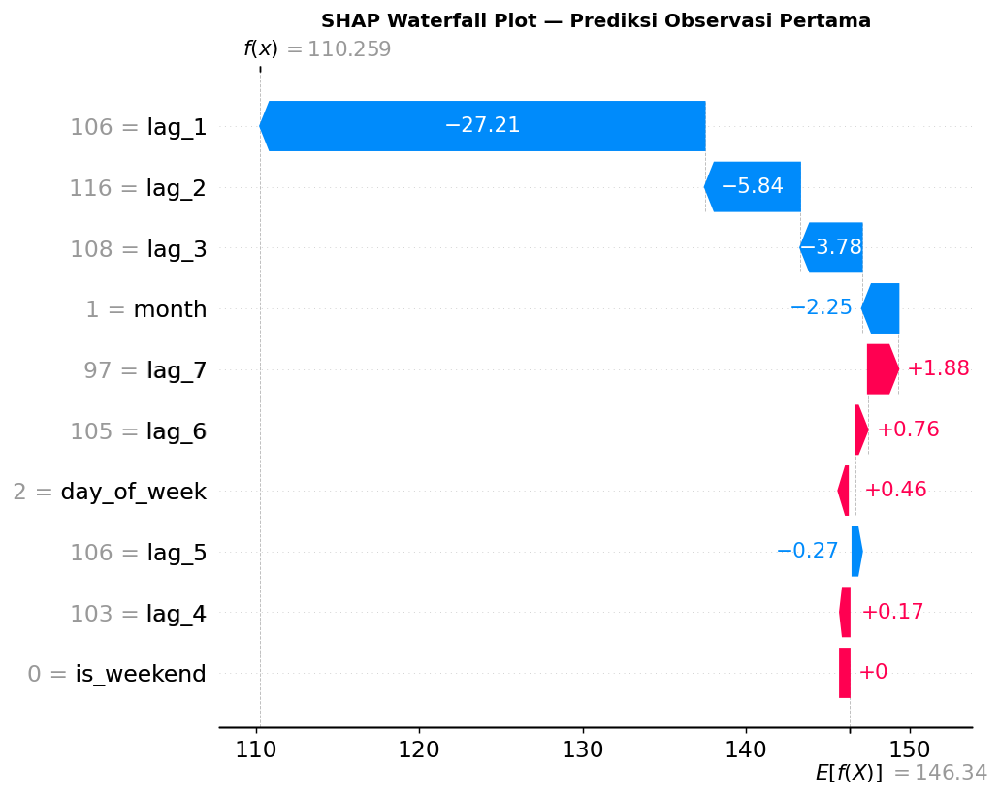
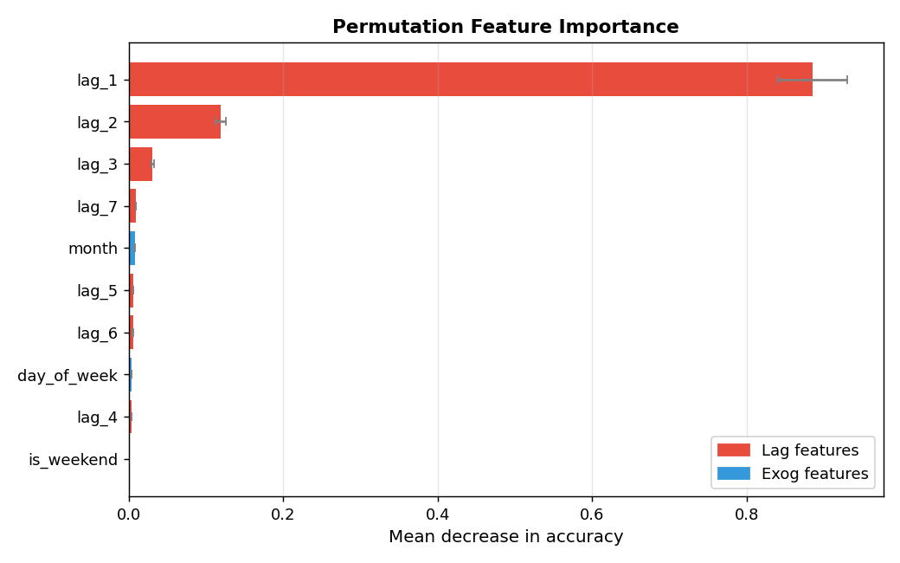
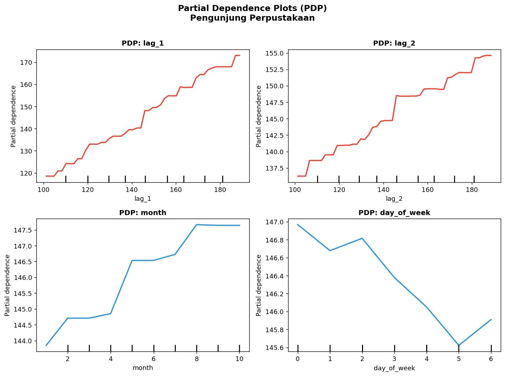

# Laporan Analisis: Model Explainability pada Prediksi Pengunjung Perpustakaan
> **Referensi Tutorial:** [skforecast 0.15.1 — Explainability](https://skforecast.org/0.15.1/user_guides/explainability.html)  
> **Dataset:** `library_visitors.csv` — Pengunjung Harian Perpustakaan Tahun 2025  
> **Tools:** Python · skforecast 0.15.1 · LightGBM · SHAP · scikit-learn  

---

## 1. Analisis Prediksi tentang Apa?

Analisis ini berfokus pada **prediksi jumlah pengunjung perpustakaan harian** menggunakan pendekatan *machine learning time series forecasting*.

### Gambaran Data

| Atribut | Nilai |
|---|---|
| Nama file | `library_visitors.csv` |
| Kolom | `tanggal`, `pengunjung` |
| Periode | 1 Januari 2025 – 31 Desember 2025 |
| Jumlah observasi | 365 hari |
| Rata-rata pengunjung/hari | 154.8 orang |
| Min – Maks | 87 – 226 orang |
| Standar deviasi | ±32.98 orang |

### Tujuan Prediksi

Model dilatih pada data **Januari – Oktober 2025 (304 hari)** dan memprediksi jumlah pengunjung untuk **November – Desember 2025 (61 hari)** ke depan.

Tujuan utama bukan hanya mendapatkan prediksi yang akurat, tetapi juga memahami **mengapa** model membuat prediksi tersebut — inilah inti dari *model explainability*.

### Visualisasi Time Series



> **Garis biru** = data training (Jan–Okt), **garis oranye** = data test aktual (Nov–Des), **garis merah putus-putus** = prediksi model

### Performa Model

| Metrik | Nilai |
|---|---|
| MAE (Mean Absolute Error) | 23.48 orang/hari |
| RMSE (Root Mean Squared Error) | 26.13 orang/hari |
| MAPE (Mean Abs. Percentage Error) | 11.38% |

---

## 2. Bentuk Data Training: Input dan Output

### Arsitektur ForecasterRecursive

Model menggunakan `ForecasterRecursive` dari skforecast dengan parameter:

```python
from skforecast.recursive import ForecasterRecursive
from lightgbm import LGBMRegressor

forecaster = ForecasterRecursive(
    regressor = LGBMRegressor(n_estimators=100, random_state=42),
    lags = 7          # ← gunakan 7 hari sebelumnya sebagai input
)

forecaster.fit(
    y    = data_train['pengunjung'],
    exog = data_train[['day_of_week', 'month', 'is_weekend']]
)
```

Matriks training dihasilkan dengan:
```python
X_train, y_train = forecaster.create_train_X_y(
    y    = data_train['pengunjung'],
    exog = data_train[['day_of_week', 'month', 'is_weekend']]
)
```

### Struktur Matriks Training

| Dimensi | Nilai |
|---|---|
| `X_train` shape | **(297 baris × 10 kolom)** |
| `y_train` shape | **(297 nilai)** |

> Catatan: dari 304 hari training, 7 baris pertama tidak masuk X_train karena digunakan untuk mengisi lag_1 s.d. lag_7 (sehingga 304 − 7 = **297 sampel**).

### Kolom-kolom X_train (INPUT)

| Kelompok | Fitur | Keterangan |
|---|---|---|
| **Lag Features** (7 kolom) | `lag_1` | Pengunjung **kemarin** (t-1) |
| | `lag_2` | Pengunjung **2 hari lalu** (t-2) |
| | `lag_3` | Pengunjung **3 hari lalu** (t-3) |
| | `lag_4` | Pengunjung **4 hari lalu** (t-4) |
| | `lag_5` | Pengunjung **5 hari lalu** (t-5) |
| | `lag_6` | Pengunjung **6 hari lalu** (t-6) |
| | `lag_7` | Pengunjung **7 hari lalu** (t-7) |
| **Exogenous Features** (3 kolom) | `day_of_week` | Hari dalam minggu (0=Senin…6=Minggu) |
| | `month` | Bulan (1–12) |
| | `is_weekend` | 1 jika Sabtu/Minggu, 0 jika tidak |

### Target y_train (OUTPUT)

`y_train` = **jumlah pengunjung pada hari ke-t** (nilai yang ingin diprediksi).

### Ilustrasi Matriks Training



Contoh 5 baris pertama X_train:

```
date         lag_1  lag_2  lag_3  lag_4  lag_5  lag_6  lag_7  day_of_week  month  is_weekend
2025-01-08   106.0  116.0  108.0  103.0  106.0  105.0   97.0          2.0    1.0         0.0
2025-01-09   113.0  106.0  116.0  108.0  103.0  106.0  105.0          3.0    1.0         0.0
2025-01-10   120.0  113.0  106.0  116.0  108.0  103.0  106.0          4.0    1.0         0.0
2025-01-11   114.0  120.0  113.0  106.0  116.0  108.0  103.0          5.0    1.0         1.0
2025-01-12   116.0  114.0  120.0  113.0  106.0  116.0  108.0          6.0    1.0         1.0
```

---

## 3. Apa itu Lag?

### Definisi Lag

**Lag** adalah nilai historis dari deret waktu (*time series*) yang digunakan sebagai fitur input untuk memprediksi nilai masa depan.

Secara matematis:

```
lag_k  →  y(t - k)

lag_1  =  y(t-1)  = nilai pengunjung KEMARIN
lag_2  =  y(t-2)  = nilai pengunjung 2 hari lalu
lag_7  =  y(t-7)  = nilai pengunjung seminggu lalu
```

### Ilustrasi Konsep Lag



### Analogi Lag

> Bayangkan Anda ingin memprediksi berapa pengunjung perpustakaan **hari ini (Kamis, 8 Jan)**:
> - `lag_1` = pengunjung Rabu (7 Jan) = **106 orang**
> - `lag_2` = pengunjung Selasa (6 Jan) = **116 orang**
> - `lag_7` = pengunjung Kamis pekan lalu (1 Jan) = **97 orang**

Model belajar dari pola: *"Kalau kemarin ramai, hari ini kemungkinan juga ramai."*

### Mengapa Lag = 7?

Pilihan `lags=7` berarti model melihat **1 minggu ke belakang** karena:
- Pola kunjungan perpustakaan kuat dipengaruhi hari dalam seminggu
- Senin–Jumat (hari kerja) vs Sabtu–Minggu (akhir pekan) memiliki pola berbeda
- lag_7 menangkap *"efek hari yang sama di minggu lalu"*

---

## 4. Proses Analisis yang Dilakukan

Analisis ini mengikuti alur dari tutorial skforecast 0.15.1 dengan 5 tahap utama:

```
1. Persiapan Data & Feature Engineering
         ↓
2. Build & Fit Forecaster
         ↓
3. Model-specific Feature Importance (get_feature_importances)
         ↓
4. SHAP Values (TreeExplainer)
         ↓
5. Permutation Importance + Partial Dependence Plots (PDP)
```

---

### Tahap 1: Persiapan Data & Feature Engineering

```python
import pandas as pd
from skforecast.recursive import ForecasterRecursive
from lightgbm import LGBMRegressor

df = pd.read_csv('library_visitors.csv')
df['tanggal'] = pd.to_datetime(df['tanggal'])
df = df.set_index('tanggal').asfreq('D')

# Feature engineering exogenous
df['day_of_week'] = df.index.dayofweek    # 0=Senin … 6=Minggu
df['month']       = df.index.month        # 1 – 12
df['is_weekend']  = (df.index.dayofweek >= 5).astype(int)

# Train/test split
data_train = df[:'2025-10-31']   # 304 hari
data_test  = df['2025-11-01':]   # 61 hari
```

---

### Tahap 2: Build & Fit Forecaster

```python
forecaster = ForecasterRecursive(
    regressor = LGBMRegressor(n_estimators=100, random_state=42, verbose=-1),
    lags = 7
)
forecaster.fit(
    y    = data_train['pengunjung'],
    exog = data_train[['day_of_week', 'month', 'is_weekend']]
)

# Buat matriks training untuk explainability
X_train, y_train = forecaster.create_train_X_y(
    y    = data_train['pengunjung'],
    exog = data_train[['day_of_week', 'month', 'is_weekend']]
)
```

---

### Tahap 3: Model-specific Feature Importance

Metode ini mengakses atribut bawaan model LightGBM (`feature_importances_`).

```python
fi = forecaster.get_feature_importances()
print(fi.sort_values('importance', ascending=False))
```

#### Hasil Feature Importance (LightGBM Built-in)

| Fitur | Importance (split) |
|---|---|
| lag_1 | **186** |
| lag_2 | 151 |
| lag_7 | 149 |
| lag_3 | 124 |
| lag_6 | 114 |
| lag_4 | 109 |
| lag_5 | 107 |
| month | 61 |
| day_of_week | 59 |
| is_weekend | 0 |



**Interpretasi:** `lag_1` (data kemarin) adalah prediktor paling kuat. Fitur `is_weekend` memiliki kontribusi = 0 karena informasinya sudah tercakup dalam `day_of_week`.

---

### Tahap 4: SHAP Values (TreeExplainer)

SHAP (*SHapley Additive exPlanations*) mengukur kontribusi *setiap fitur* terhadap *setiap prediksi* secara individual — lebih detail dari feature importance biasa.

```python
import shap

explainer   = shap.TreeExplainer(forecaster.regressor)
shap_values = explainer.shap_values(X_train)
```

#### SHAP Mean |value| per Fitur

| Fitur | Mean |SHAP| |
|---|---|
| lag_1 | **15.18** |
| lag_2 | 4.63 |
| lag_3 | 2.45 |
| month | 1.19 |
| lag_7 | 0.88 |
| lag_5 | 0.80 |
| lag_6 | 0.54 |
| lag_4 | 0.43 |
| day_of_week | 0.43 |
| is_weekend | 0.00 |

#### SHAP Summary Plot



> Setiap titik adalah satu observasi. Warna merah = nilai fitur tinggi, biru = nilai fitur rendah. Posisi di sumbu-x menunjukkan apakah fitur tersebut mendorong prediksi **naik (+)** atau **turun (-)**.

#### SHAP Bar Plot (Mean |SHAP|)



#### SHAP Waterfall Plot (Satu Prediksi)



> Waterfall plot menjelaskan prediksi untuk **satu observasi spesifik**: mulai dari baseline (rata-rata semua prediksi), lalu setiap fitur menambah atau mengurangi nilai prediksi.

**Interpretasi SHAP:** `lag_1` mendominasi dengan kontribusi rata-rata ±15.18 pengunjung per prediksi. Artinya, data hari kemarin adalah sinyal paling penting untuk meramalkan hari ini.

---

### Tahap 5: Permutation Importance

Permutation importance mengukur seberapa besar performa model menurun ketika nilai satu fitur **diacak secara acak**.

```python
from sklearn.inspection import permutation_importance

r = permutation_importance(
    estimator  = forecaster.regressor,
    X          = X_train,
    y          = y_train,
    n_repeats  = 5,
    max_samples = 0.8,
    random_state = 42
)
```



> Error bar (±) menunjukkan variasi dari 5 kali pengacakan. Semakin panjang bar, semakin penting fitur tersebut.

---

### Tahap 5b: Partial Dependence Plots (PDP)

PDP menunjukkan **bagaimana prediksi berubah** ketika nilai satu fitur divariasikan, sementara fitur lain tetap pada nilai rata-ratanya.

```python
from sklearn.inspection import PartialDependenceDisplay

PartialDependenceDisplay.from_estimator(
    estimator    = forecaster.regressor,
    X            = X_train,
    features     = ['lag_1', 'lag_2', 'month', 'day_of_week'],
    feature_names = X_train.columns.tolist()
)
```



**Interpretasi PDP:**
- **lag_1 & lag_2**: Hubungan positif — semakin banyak pengunjung kemarin/kemarin lusa, semakin tinggi prediksi hari ini (pola *momentum*)
- **month**: Terlihat pola musiman — kunjungan cenderung meningkat di bulan-bulan tertentu (semester baru, ujian, akhir tahun)
- **day_of_week**: Kunjungan berbeda antar hari — hari kerja vs akhir pekan

---

## Ringkasan: 4 Metode Explainability

| Metode | Apa yang Diukur | Granularitas | Kode Utama |
|---|---|---|---|
| **Feature Importance (built-in)** | Kontribusi fitur saat training (split gain) | Global | `forecaster.get_feature_importances()` |
| **SHAP Values** | Kontribusi fitur per prediksi (Shapley value) | Per observasi | `shap.TreeExplainer(...)` |
| **Permutation Importance** | Penurunan performa jika fitur diacak | Global | `permutation_importance(...)` |
| **Partial Dependence Plot** | Hubungan marginal fitur–target | Global (rata-rata) | `PartialDependenceDisplay.from_estimator(...)` |

---

## Kesimpulan

1. **Model memprediksi** jumlah pengunjung perpustakaan harian dengan MAPE ~11.4%, yang berarti rata-rata meleset sekitar 23 orang per hari dari total ~155 orang.

2. **Lag features** (terutama `lag_1`) adalah prediktor paling dominan, dikonfirmasi oleh **semua 4 metode explainability**. Ini berarti *hari kemarin* adalah referensi terkuat untuk prediksi hari ini.

3. **Fitur temporal** seperti `month` dan `day_of_week` memberikan kontribusi yang signifikan, menangkap pola musiman dan pola mingguan kunjungan perpustakaan.

4. **`is_weekend`** berkontribusi nol karena informasinya redundan dengan `day_of_week` (hari 5 dan 6 sudah mewakili akhir pekan).

5. **SHAP** memberikan pemahaman paling kaya karena bisa menjelaskan prediksi di level per-observasi, tidak hanya secara global.

---

## Kode Lengkap untuk Google Colab

```python
# ============================================================
# Instalasi
# ============================================================
!pip install skforecast==0.15.1 lightgbm shap -q

# ============================================================
# Import Libraries
# ============================================================
import warnings; warnings.filterwarnings('ignore')
import pandas as pd
import numpy as np
import matplotlib.pyplot as plt
import shap
from lightgbm import LGBMRegressor
from sklearn.inspection import permutation_importance, PartialDependenceDisplay
from skforecast.recursive import ForecasterRecursive

# ============================================================
# 1. Load Data
# ============================================================
# Upload file CSV ke Colab terlebih dahulu, lalu:
df = pd.read_csv('library_visitors.csv')
df['tanggal'] = pd.to_datetime(df['tanggal'])
df = df.set_index('tanggal').asfreq('D')
df.index.name = 'date'

# Feature Engineering
df['day_of_week'] = df.index.dayofweek
df['month']       = df.index.month
df['is_weekend']  = (df.index.dayofweek >= 5).astype(int)

# ============================================================
# 2. Split Data
# ============================================================
data_train = df[:'2025-10-31']
data_test  = df['2025-11-01':]

# ============================================================
# 3. Build & Fit Forecaster
# ============================================================
forecaster = ForecasterRecursive(
    regressor = LGBMRegressor(n_estimators=100, random_state=42, verbose=-1),
    lags = 7
)
forecaster.fit(
    y    = data_train['pengunjung'],
    exog = data_train[['day_of_week', 'month', 'is_weekend']]
)

# Matriks Training
X_train, y_train = forecaster.create_train_X_y(
    y    = data_train['pengunjung'],
    exog = data_train[['day_of_week', 'month', 'is_weekend']]
)
print("X_train shape:", X_train.shape)
print("Kolom:", X_train.columns.tolist())

# ============================================================
# 4. Prediksi & Evaluasi
# ============================================================
pred = forecaster.predict(
    steps=len(data_test),
    exog=data_test[['day_of_week','month','is_weekend']]
)

# ============================================================
# 5a. Feature Importance (Built-in LightGBM)
# ============================================================
fi = forecaster.get_feature_importances()
print(fi.sort_values('importance', ascending=False))

# ============================================================
# 5b. SHAP Values
# ============================================================
shap.initjs()
explainer   = shap.TreeExplainer(forecaster.regressor)
shap_values = explainer.shap_values(X_train)

# Summary plot
shap.summary_plot(shap_values, X_train)

# Force plot (observasi pertama)
shap.force_plot(explainer.expected_value, shap_values[0,:], X_train.iloc[0,:])

# ============================================================
# 5c. Permutation Importance
# ============================================================
r = permutation_importance(
    estimator=forecaster.regressor,
    X=X_train, y=y_train,
    n_repeats=5, max_samples=0.8, random_state=42
)

# ============================================================
# 5d. Partial Dependence Plot
# ============================================================
PartialDependenceDisplay.from_estimator(
    estimator=forecaster.regressor,
    X=X_train,
    features=[0, 1, 7, 8],   # lag_1, lag_2, month, day_of_week
    feature_names=X_train.columns.tolist()
)
plt.show()
```

---

*Laporan dibuat menggunakan Python + skforecast 0.15.1 · Dataset: library_visitors.csv*