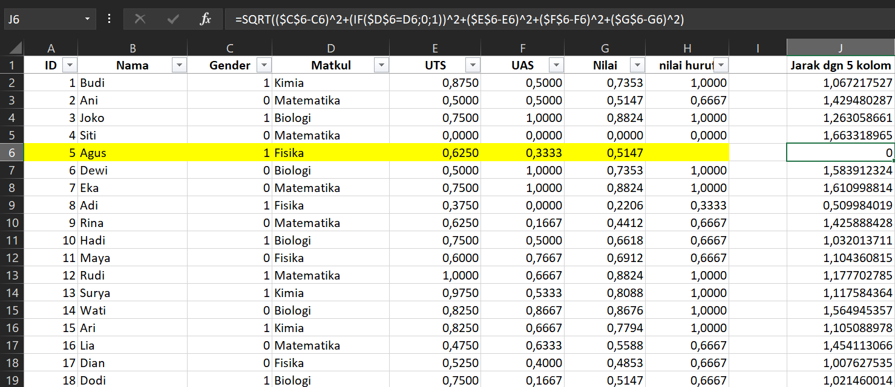
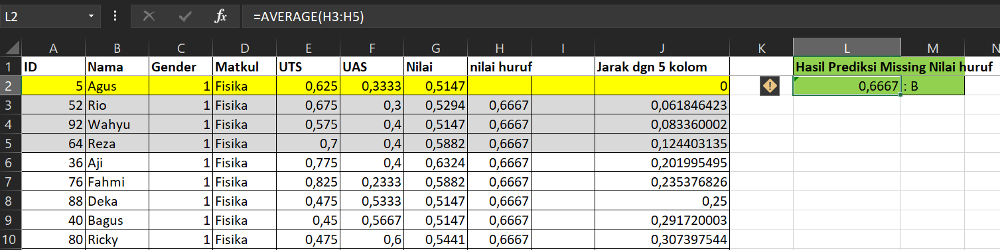

# Prediksi Missing Value 
**Nilai Huruf Data ke-5**

## Data ke-5 (Agus)

| Gender    | Matkul | UTS | UAS | Nilai | Nilai Huruf |
|-----------|--------|-----|-----|-------|-------------|
| Laki-laki | Fisika | 80  | 75  | 77.5  | **?**       |

Karena **Nilai Huruf bersifat kategorikal**, KNN akan mencari tetangga terdekat lalu mengambil **modus** (nilai huruf yang paling sering muncul).

---

## Metode: KNN dengan K = 3

Jarak dihitung menggunakan kolom numerik: **UTS, UAS, Nilai**

$$d(a,b) = \sqrt{(UTS_a - UTS_b)^2 + (UAS_a - UAS_b)^2 + (Nilai_a - Nilai_b)^2}$$

---

## Perhitungan Jarak dari Agus ke Data Lain

Data Agus: UTS = 80, UAS = 75, Nilai = 77.5

**d(5 → 17) | Dian | UTS=76, UAS=77, Nilai=76.5:**
$$d = \sqrt{(80-76)^2 + (75-77)^2 + (77.5-76.5)^2} = \sqrt{16 + 4 + 1} = \sqrt{21} \approx \mathbf{4.58}$$

**d(5 → 52) | Rio | UTS=82, UAS=74, Nilai=78:**
$$d = \sqrt{(80-82)^2 + (75-74)^2 + (77.5-78)^2} = \sqrt{4 + 1 + 0.25} = \sqrt{5.25} \approx \mathbf{2.29}$$

**d(5 → 88) | Deka | UTS=74, UAS=81, Nilai=77.5:**
$$d = \sqrt{(80-74)^2 + (75-81)^2 + (77.5-77.5)^2} = \sqrt{36 + 36 + 0} = \sqrt{72} \approx \mathbf{8.49}$$

**d(5 → 40) | Bagus | UTS=73, UAS=82, Nilai=77.5:**
$$d = \sqrt{(80-73)^2 + (75-82)^2 + (77.5-77.5)^2} = \sqrt{49 + 49 + 0} = \sqrt{98} \approx \mathbf{9.90}$$

---

## Urutkan & Pilih 3 Terdekat (K=3)

| Peringkat | No | Nama | Jarak | Nilai Huruf |
|-----------|----|------|-------|-------------|
| 1         | 52 | Rio  | 2.29  | B           |
| 2         | 17 | Dian | 4.58  | B           |
| 3         | 88 | Deka | 8.49  | B           |

---

## Hasil: Ambil Modus

$$\text{Modus} = B \quad (3 \text{ dari } 3 \text{ tetangga})$$

| Gender    | Matkul | UTS | UAS | Nilai | Nilai Huruf |
|-----------|--------|-----|-----|-------|-------------|
| Laki-laki | Fisika | 80  | 75  | 77.5  | **B**       |

> Nilai huruf asli Agus pada dataset = **B** ✓ Prediksi KNN tepat.

### Menghitung Jarak

### Jarak Terdekat dihitung dan dikembalikan ke nilai terdekat

Hasil Prediksi ditemukan adalah sama dengan nilai yang menempati huruf B.

