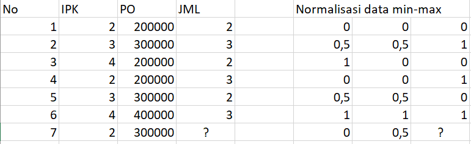
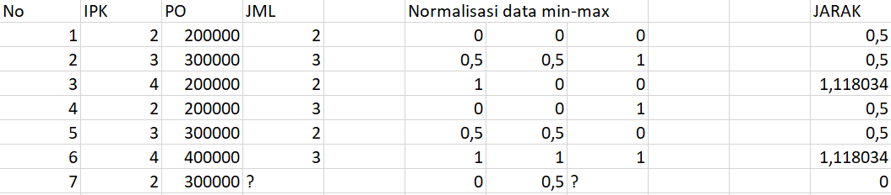
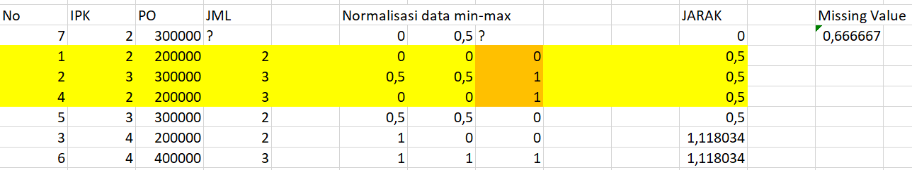

# Prediksi Missing Value Data Soal

Terdapat Data dengan missing Value sebagai berikut.

Data diatas sudah dinormalisasi dengan cara min-max, sehingga tinggal menghitung jarak untuk memprediksi Missing Value.

## Jarak

Jarak dari data ke-7 dan yang lain bedasarkan 2 kolom IPK dan PO.

## Missing Value

Dari jarak yang ditemukan, kemudian diurutkan dari yang paling kecil. Disini K = 3, dari ketiga data teratas maka didapat missing valuenya adalah 0,6.

jika dilihat dari data aslinya adalah 2 dan 3 dan kalau saat normalisasi adalah 0 dan 1 , sedangkan yang didapat disini adalah 0,6, maka bisa dibulatkan menjadi 1.