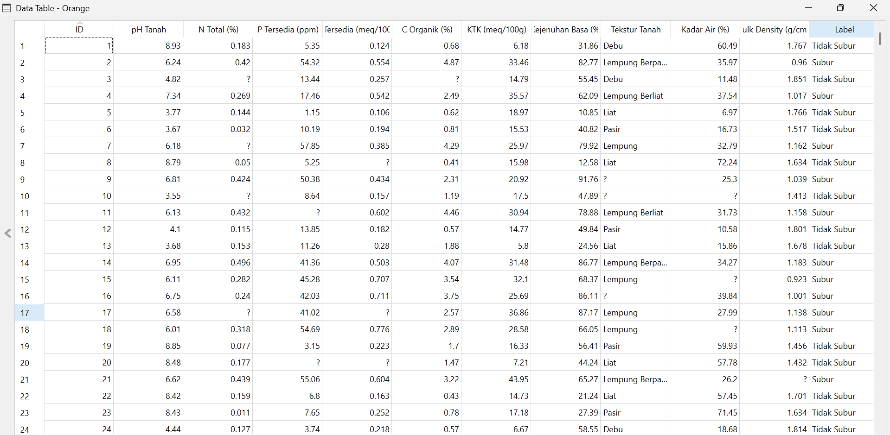
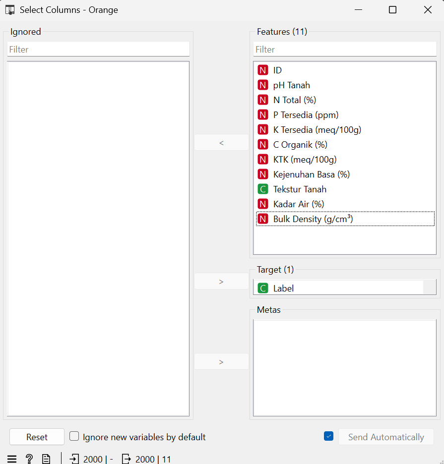
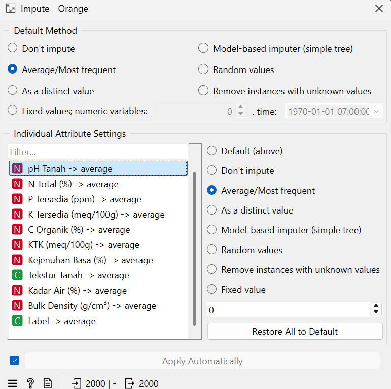
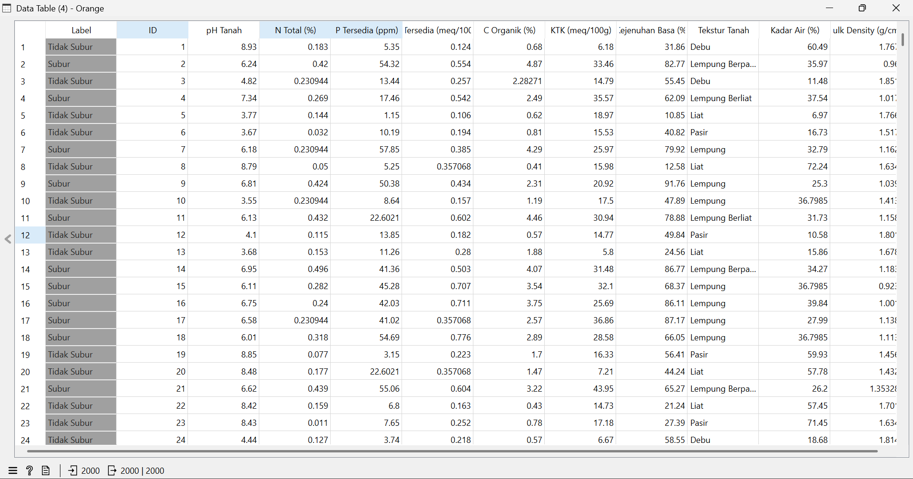
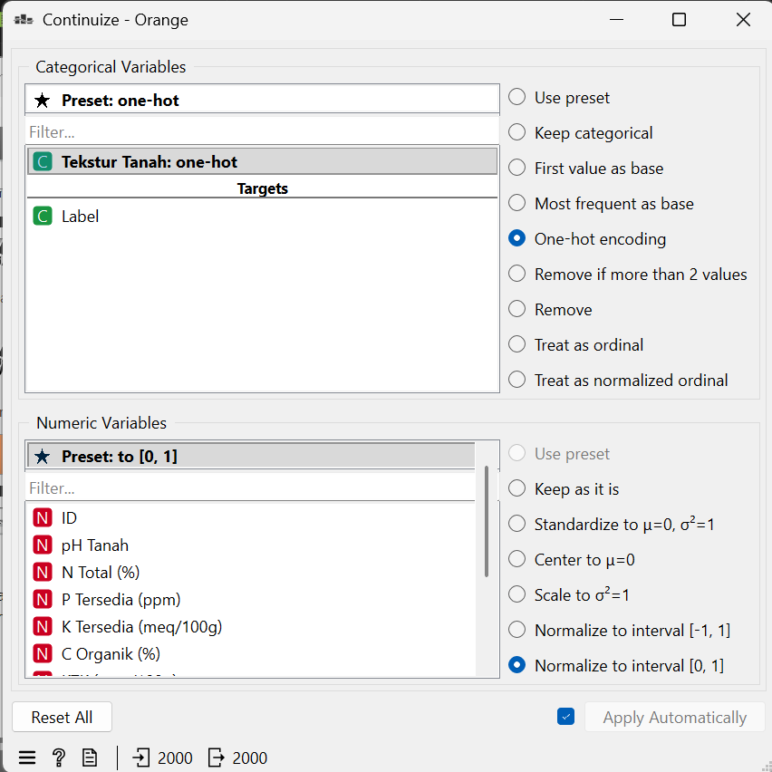
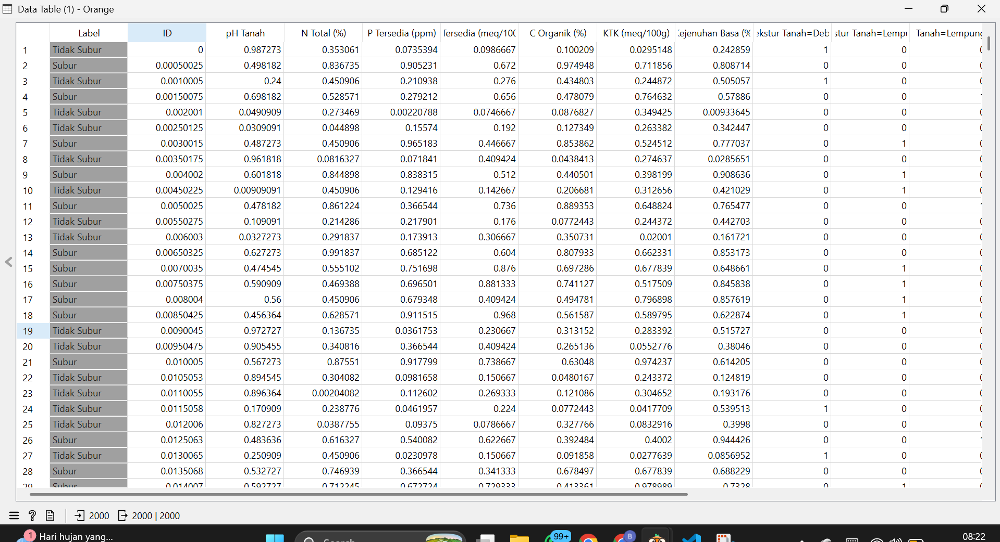
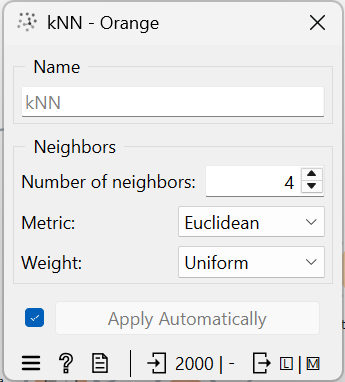
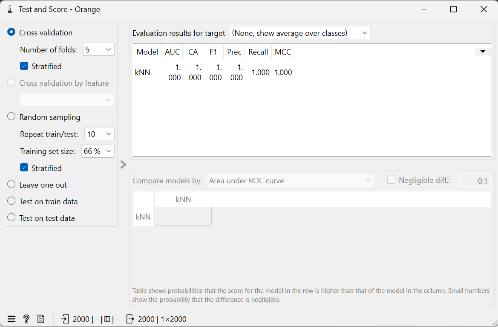
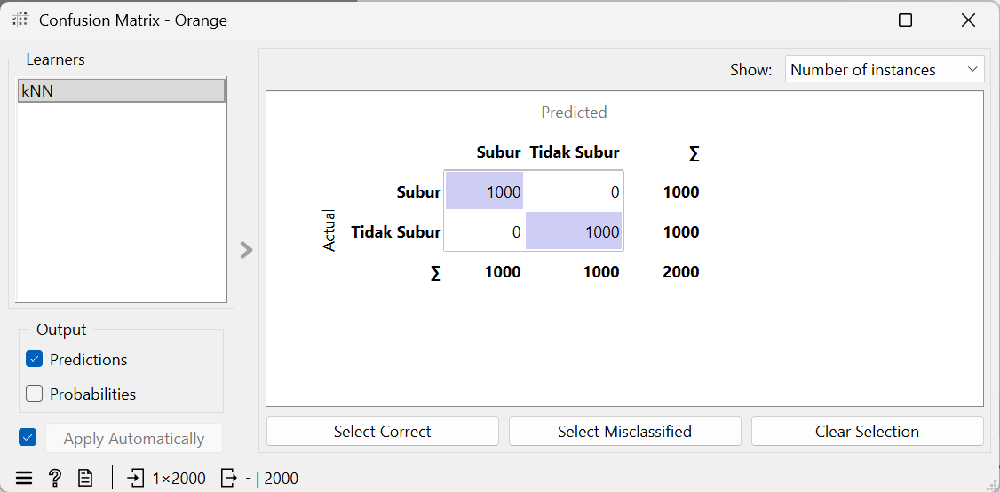
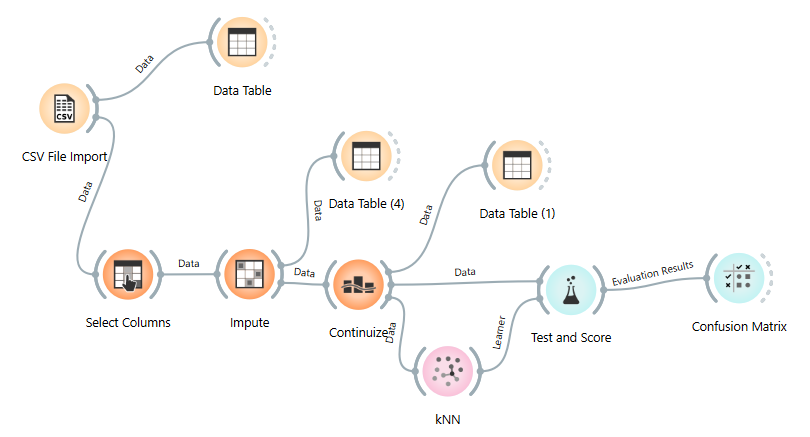

# Analisa Data Kesuburan Tanah
# UTS


# Dataset Klasifikasi Kesuburan Tanah

## Deskripsi Umum

 Dataset berisi **2.000 sampel** data tanah dengan **10 fitur agronomis** dan **1 kolom label** yang membagi kondisi tanah menjadi dua kelas: **Subur** dan **Tidak Subur**. Data mengandung missing values (data hilang)
[Unduh data Kesuburan Tanah](https://docs.google.com/spreadsheets/d/1_VTOGjavAI1Axd4gFRhXrIKRVVjY9zvM/edit?usp=sharing&ouid=108447658857677622027&rtpof=true&sd=true)

---

## Informasi `Dataset`

| Atribut | Keterangan |
|---|---|
| Jumlah Sampel | 2.000 baris |
| Jumlah Fitur | 10 fitur (9 numerik, 1 kategorikal) |
| Jumlah Kelas | 2 kelas |
| Target / Label | `Subur` / `Tidak Subur` |
|                |                                     |
|                |                                     |

---

## Penjelasan Fitur

### 1. `pH Tanah`
- **Satuan:** Skala pH (0–14)
- **Deskripsi:** Tingkat keasaman atau kebasaan tanah. pH optimal untuk pertanian berkisar 6,0–7,5.
- **Nilai Subur:** 6,0 – 7,5
- **Nilai Tidak Subur:** 3,5 – 5,4 (asam kuat) atau 7,6 – 9,0 (basa kuat)

### 2. `N Total (%)`
- **Satuan:** Persen (%)
- **Deskripsi:** Kandungan nitrogen total dalam tanah. Nitrogen sangat penting untuk pertumbuhan vegetatif tanaman.
- **Nilai Subur:** 0,21 – 0,50%
- **Nilai Tidak Subur:** 0,01 – 0,20%

### 3. `P Tersedia (ppm)`
- **Satuan:** Parts per million (ppm)
- **Deskripsi:** Fosfor tersedia yang dapat diserap tanaman. Fosfor berperan dalam pembentukan akar dan buah.
- **Nilai Subur:** 15 – 60 ppm
- **Nilai Tidak Subur:** 1 – 14 ppm

### 4. `K Tersedia (meq/100g)`
- **Satuan:** Milliequivalent per 100 gram tanah
- **Deskripsi:** Kalium tersedia dalam tanah. Penting untuk ketahanan tanaman dan proses fotosintesis.
- **Nilai Subur:** 0,30 – 0,80 meq/100g
- **Nilai Tidak Subur:** 0,05 – 0,29 meq/100g

### 5. `C Organik (%)`
- **Satuan:** Persen (%)
- **Deskripsi:** Kandungan karbon organik tanah, indikator utama kesuburan dan kesehatan biologi tanah.
- **Nilai Subur:** 2,0 – 5,0%
- **Nilai Tidak Subur:** 0,2 – 1,9%

### 6. `KTK (meq/100g)`
- **Satuan:** Milliequivalent per 100 gram tanah
- **Deskripsi:** Kapasitas Tukar Kation — kemampuan tanah mengikat dan menyediakan unsur hara bagi tanaman. Semakin tinggi semakin subur.
- **Nilai Subur:** 20 – 45 meq/100g
- **Nilai Tidak Subur:** 5 – 19 meq/100g

### 7. `Kejenuhan Basa (%)`
- **Satuan:** Persen (%)
- **Deskripsi:** Persentase kation basa (Ca, Mg, K, Na) dari total KTK. Menggambarkan kualitas kesuburan kimia tanah.
- **Nilai Subur:** 60 – 100%
- **Nilai Tidak Subur:** 10 – 59%

### 8. `Tekstur Tanah`
- **Tipe:** Kategorikal
- **Deskripsi:** Komposisi partikel tanah yang memengaruhi drainase, aerasi, dan kemampuan menahan air.

| Kelas | Tekstur yang Umum |
|---|---|
| **Subur** | Lempung, Lempung Berpasir, Lempung Berliat |
| **Tidak Subur** | Pasir, Liat, Debu |

### 9. `Kadar Air (%)`
- **Satuan:** Persen (%)
- **Deskripsi:** Persentase kadar air dalam tanah. Terlalu kering atau terlalu basah sama-sama merugikan pertumbuhan tanaman.
- **Nilai Subur:** 25 – 45%
- **Nilai Tidak Subur:** 5 – 20% (terlalu kering) atau 55 – 75% (terlalu basah)

### 10. `Bulk Density (g/cm³)`
- **Satuan:** Gram per sentimeter kubik
- **Deskripsi:** Kerapatan tanah. Nilai tinggi menandakan tanah padat, aerasi buruk, dan sulit ditembus akar.
- **Nilai Subur:** 0,9 – 1,2 g/cm³
- **Nilai Tidak Subur:** 1,4 – 1,9 g/cm³

---

## Definisi Kelas

| Label | Deskripsi |
|---|---|
| **Subur** | Tanah dengan kondisi fisik, kimia, dan biologi yang optimal untuk pertumbuhan tanaman. Ditandai dengan pH seimbang, unsur hara cukup, tekstur ideal, dan struktur tanah yang baik. |
| **Tidak Subur** | Tanah yang memiliki satu atau lebih kondisi pembatas seperti pH ekstrem, kekurangan unsur hara, tekstur buruk, kadar air tidak ideal, atau kerapatan tanah tinggi. |

---

## Distribusi Kelas

```
Subur        : 1.000 sampel (50%)
Tidak Subur  : 1.000 sampel (50%)
Total        : 2.000 sampel
```

> 

---


# Preprosesing menggunakan Orange

## Table View Awal


## Memilih kolom Label

Disini memilih target yaitu label sebagai acuan yang akan di tampilkan hasilnya yaitu antara subur dan tidak subur.
dan kolom yang lain sebagai fitur.

## Mencari missing Values

Dari dataset yang diberikan terdapat banyak missing values yang harus dicari sebelum dilakukan normalisasi, disini untuk mengisi missing value yaitu menggunakan impute dengan method average atau most frequence.

dan didapat hasilnya setelah proses tersebut sebagai berikut.



## Normalisasi data

Setelah melengkapi semua data, maka hal selanjutnya yaitu normalisasi data sebelum diproses lebih lanjut.
disini untuk nnoermalisasi menggunakan widget continnuize, dengan target label, dan fitur yang dinormalisasi antara 0 - 1.

dan didapat hasilnya setelah proses tersebut sebagai berikut.



# Eksekusi data 
## kNN

Menghitung kNN dengan K = 4 dan metode yang digunakan adalah Euclidean

## Test dan Score

Dari hasil kNN dan Normalisasi didapatkan bahwa:

| Atribut | Hasil |
|---|---|
| Accuracy | 1.000 |
| Precision | 1.000 |
| Recall | 1.000 |
| F1-Score | 1.000 |

## Matrix

Dari hasil test and score maka didapat matriks yaitu:

| | Subur | Tidak Subur |
|---|---|---|---|
| subur | 1000 | 0 |
| Tidak subur | 0 | 1000 | 

Maka didapat subur = 1000 dan tidak subur 1000 dari total 2000.

## Alur Dalam Orange


